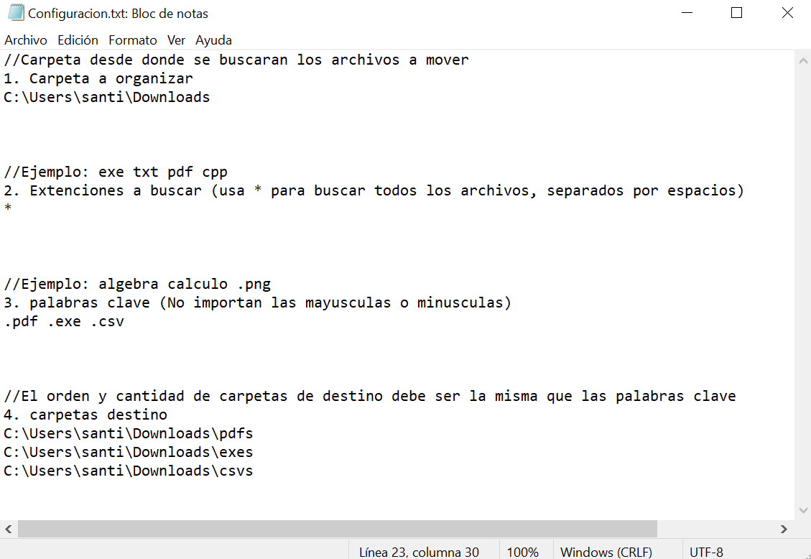
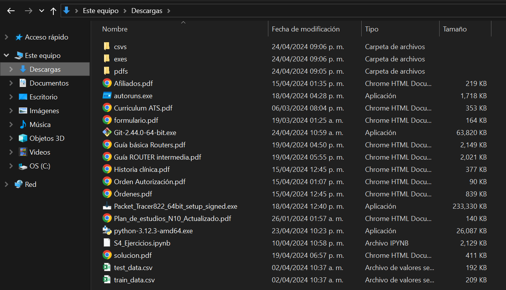
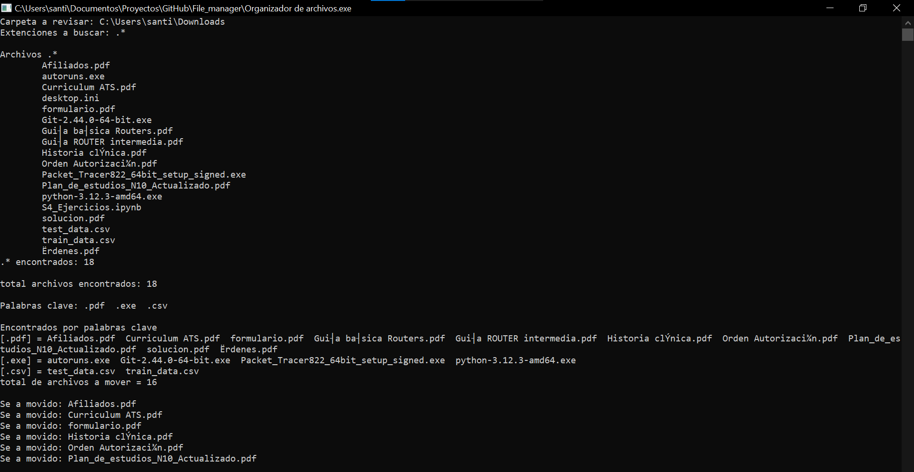
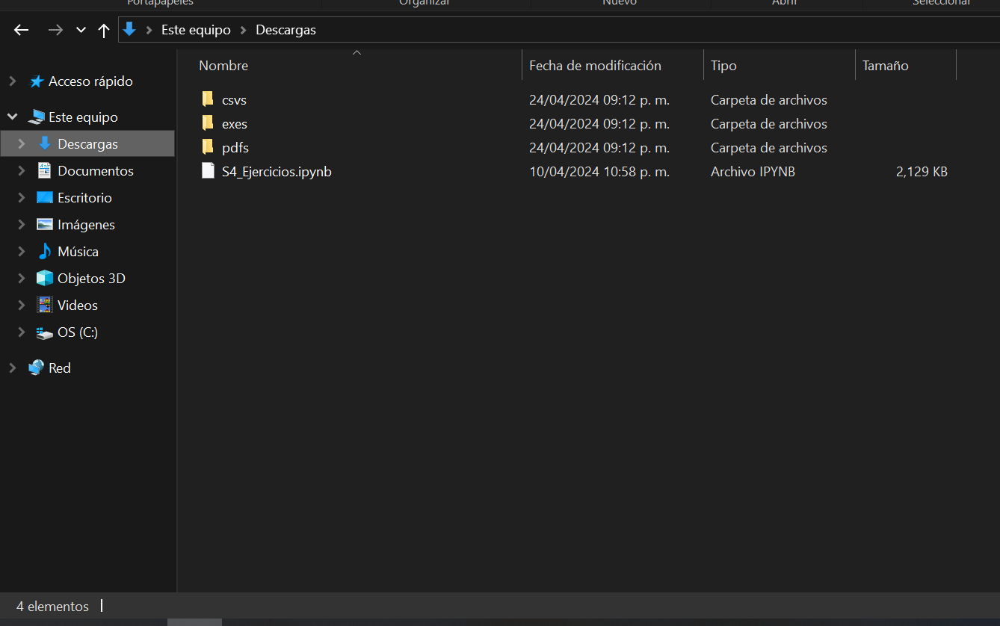

# Simple_file_manager
 
## Organizador de archivos en C++

Este proyecto es un organizador de archivos desarrollado en C++. Su objetivo es ayudar a los usuarios a organizar sus archivos de manera automática según criterios específicos definidos por el usuario.

## Características principales:

- **Filtrado por palabra clave**: El programa permite filtrar archivos basados en palabras clave definidas por el usuario en un archivo de configuración.
- **Filtrado por extensión**: Los archivos se pueden filtrar por extensión, permitiendo al usuario especificar qué tipos de archivos desea organizar.
- **Movimiento automático**: Los archivos seleccionados según los filtros establecidos se mueven automáticamente a las carpetas de destino designadas en el archivo de configuración.

## Ejemplo de funcionamiento:

1. **Configuración**: El usuario define las palabras clave y las carpetas de origen y destino en el archivo `Configuracion.txt`. Aquí tienes un ejemplo de cómo podría lucir esa configuración:

2. **Antes de la ejecución**: Antes de ejecutar el programa, la carpeta de origen contiene archivos desorganizados.

3. **Ejecución del programa**: Una vez que el programa se ejecuta, organiza automáticamente los archivos según los criterios especificados en la configuración.

4. **Resultado**: Después de la ejecución, los archivos se encuentran organizados en las carpetas de destino según los criterios definidos.

## Licencia:

Este proyecto está licenciado bajo la [Licencia MIT](LICENSE).
